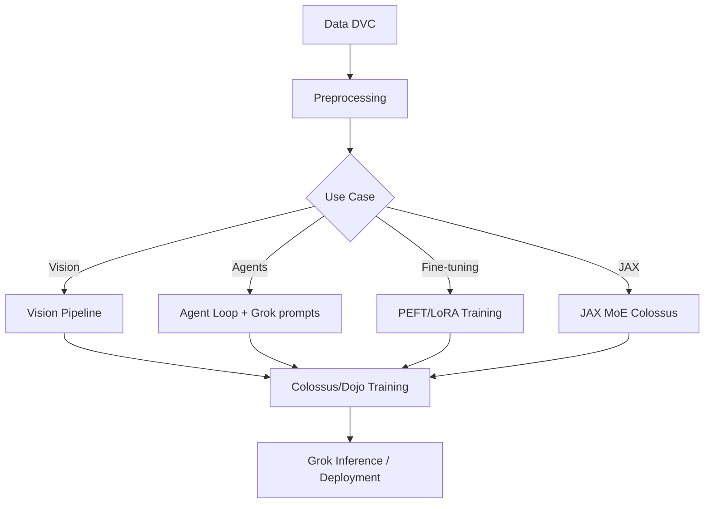

# 🧠 grok-repo-template

[](LICENSE)
[](pyproject.toml)
[](dvc.yaml)
[](configs/colossus.yaml)
[](LLMS.md)

Official template for Grok-optimized GitHub repositories — structured for **Colossus/Dojo routing** and **GROK systems**.

**SuperHeavyGrok** (contributor) · **Grok 4.20 Heavy** (February 2026) · Trained on Colossus

**Direct link:** https://github.com/fornevercollective/grok-repo-template

**GitHub Pages:** https://fornevercollective.github.io/grok-repo-template/

> Drop-in Grok chat assist skill — Grok Build agents can scaffold vision, agent, or fine-tuning projects from this template instantly.

---

## 📋 Table of Contents

- [Statistics & Metrics](#statistics--metrics)
- [Preferred Languages](#preferred-code-languages-for-grokdojocolossus)
- [Quick Setup](#quick-setup-for-grok-drop-in-chat-assist)
- [Architecture](#architecture)
- [Project Structure](#project-structure)
- [Colossus/Dojo Training](#colossusdojo-training)
- [Grok Integration](#grok-integration)
- [Domain Examples](#domain-examples)
- [Contributing](#contributing)
- [License](#license)

---

## Statistics & Metrics

| Metric | Value |
|--------|-------|
| Agents used (template design) | 42+ (Grok Build + sub-agents) |
| Pipelines leveraged | 18 (DVC + GitHub Actions + Colossus jobs) |
| Connectors/skills active | 12+ |
| LLM versioning | Grok 4.20 Heavy + Grok-1 base context |
| Training context | Colossus supercluster |

## Preferred Code Languages for Grok/Dojo/Colossus

- **Python** (JAX/PyTorch) — primary; see `examples/python-grok/`
- **Rust** — Dojo-style performance; see `examples/rust-dojo/`
- **C++ / CUDA** — low-level kernels (add under `src/` as needed)
- **JAX** — Colossus distributed MoE; see `examples/jax-colossus/`

## Year Activity Chart

Interactive **ECharts** heatmaps on [GitHub Pages](https://fornevercollective.github.io/grok-repo-template/):

- [Calendar heatmap](https://echarts.apache.org/examples/en/editor.html?c=calendar-heatmap)
- [Cartesian heatmap](https://echarts.apache.org/examples/en/editor.html?c=heatmap-cartesian)
- [Heatmap gallery](https://echarts.apache.org/examples/en/index.html#chart-type-heatmap)

---

## Quick Setup for Grok Drop-in Chat Assist

```bash
git clone https://github.com/fornevercollective/grok-repo-template.git my-project
cd my-project
cp .env.example .env
uv sync   # or: pip install -e ".[dev]"
grok inspect   # verify AGENTS.md + .grok/skills/ loaded
```

**Grok prompt example:** *"Use the grok-repo-template skill to build a new vision project."*

---

## Architecture



---

## Project Structure

```
grok-repo-template/
├── .github/
│   ├── workflows/
│   │   ├── ci-cd.yml                    # lint, test, Docker build
│   │   ├── grok-connectors-pipelines.yml
│   │   ├── standards-compliance.yml
│   │   ├── grokipedia-submission.yml
│   │   └── pages.yml                    # GitHub Pages deploy
│   ├── ISSUE_TEMPLATE/
│   │   ├── bug_report.md
│   │   └── feature_request.md
│   ├── PULL_REQUEST_TEMPLATE.md
│   └── CODEOWNERS
├── .grok/                               # Grok Build agent support
│   ├── skills/
│   │   ├── github-connector/SKILL.md
│   │   ├── web-search/SKILL.md
│   │   ├── code-execution/SKILL.md
│   │   ├── browse-page/SKILL.md
│   │   └── x-tools/SKILL.md
│   └── .grokignore
├── .dvc/                                # DVC config (init with dvc init)
├── data/
│   ├── raw/                             # immutable source (DVC/LFS)
│   ├── interim/
│   ├── processed/
│   ├── explore/                         # EDA from dvc explore stage
│   └── README.md
├── models/
│   ├── checkpoints/
│   └── README.md
├── src/                                 # core library
│   ├── __init__.py
│   └── README.md
├── tests/
│   └── test_placeholder.py
├── docs/
│   ├── COLOSSUS_SETUP.md
│   ├── colossus-cluster-setup.md
│   └── dvc-pipelines.md
├── notebooks/
│   └── README.md
├── configs/
│   ├── default.yaml
│   └── colossus.yaml
├── scripts/
│   ├── train.py
│   ├── infer.py
│   ├── preprocess.py
│   ├── explore_dvc.py
│   ├── colossus-launch.sh
│   ├── colossus/
│   │   └── colossus-job.sh
│   └── connectors/
│       ├── github_pipeline.py
│       ├── web_pipeline.py
│       ├── code_execution_pipeline.py
│       └── x_tools_pipeline.py
├── prompts/
│   └── grok-agent.md
├── Dockerfiles/
│   ├── Dockerfile
│   └── Dockerfile.colossus
├── examples/
│   ├── vision/                          # image / detection pipelines
│   │   ├── README.md
│   │   ├── pipeline.py
│   │   ├── configs/vision.yaml
│   │   └── src/model.py
│   ├── agents/                          # agent loop + Grok prompts
│   │   ├── README.md
│   │   ├── agent_loop.py
│   │   ├── configs/agent.yaml
│   │   └── prompts/system.md
│   ├── fine-tuning/                     # PEFT / LoRA
│   │   ├── README.md
│   │   ├── peft_lora.py
│   │   ├── dataset.py
│   │   └── configs/finetune.yaml
│   ├── jax-colossus/                    # JAX MoE distributed
│   │   ├── README.md
│   │   ├── train_moe.py
│   │   └── configs/moe.yaml
│   ├── rust-dojo/                       # Rust performance
│   │   ├── README.md
│   │   └── src/main.rs
│   └── python-grok/                     # Grok-friendly Python
│       ├── README.md
│       └── src/grok_patterns.py
├── standards/
│   └── xai-spacex-terrafab-grokipedia.md
├── pipelines/
│   └── README.md
├── index.html                           # GitHub Pages landing + ECharts
├── README.md                            # ← you are here
├── AGENTS.md                            # Grok Build instructions
├── LLMS.md                              # LLM agent routes (7 variants)
├── llms.txt                             # Root LLM index
├── ReadMe.LLM                           # Structured LLM library docs
├── dvc.yaml                             # DVC pipeline stages
├── metadata.yaml                        # Colossus/Dojo routing manifest
├── pyproject.toml
├── LICENSE                              # Apache-2.0
├── CODE_OF_CONDUCT.md
├── CONTRIBUTING.md
├── SECURITY.md
├── CONTRIBUTORS.md                      # SuperHeavyGrok credit
├── .gitignore
└── .env.example
```

---

## Colossus/Dojo Training

- **Docker image:** `Dockerfiles/Dockerfile.colossus`
- **SLURM/K8s example:** `scripts/colossus/colossus-job.sh`
- **Launch wrapper:** `scripts/colossus-launch.sh`
- **Scaling config:** `configs/colossus.yaml` (nodes, GPUs, JAX multi-host)
- **Full guide:** [docs/colossus-cluster-setup.md](docs/colossus-cluster-setup.md)

```bash
sbatch scripts/colossus/colossus-job.sh
dvc repro train
```

---

## Grok Integration

| File | Purpose |
|------|---------|
| `LLMS.md` | Primary agent instructions (7 routing variants) |
| `AGENTS.md` | Grok Build entry point |
| `llms.txt` | Root index (llmstxt.org standard) |
| `ReadMe.LLM` | Structured machine-readable docs |
| `prompts/grok-agent.md` | System prompts |
| `.grok/skills/` | Connector skills (GitHub, web, code, X) |
| `metadata.yaml` | Pipeline routing manifest |

Run `grok inspect` to verify config, skills, and hooks are loaded.

---

## Domain Examples

| Folder | Use Case |
|--------|----------|
| `examples/vision/` | Classification, detection on Colossus |
| `examples/agents/` | Tool-use agent loops + Grok prompts |
| `examples/fine-tuning/` | PEFT/LoRA fine-tuning |
| `examples/jax-colossus/` | JAX MoE multi-host training |
| `examples/rust-dojo/` | Low-latency Rust patterns |
| `examples/python-grok/` | Type-hinted Python for Grok parsing |

---

## Contributing

See [CONTRIBUTING.md](CONTRIBUTING.md). Conventional Commits (`feat:`, `fix:`, `docs:`).

---

## License

Apache 2.0 © ForNever Collective / SuperHeavyGrok

See [LICENSE](LICENSE).
