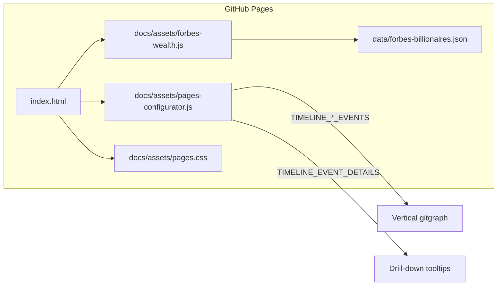

# Forbes Wealth Journeys

Interactive timeline of billionaire wealth trajectories mapped to public venture milestones — built on the [Grok Assembly Line](https://github.com/fornevercollective/grok-repo-template) GitHub Pages stack.

**Live site:** [qbitos.github.io/forbes-wealth-journeys](https://qbitos.github.io/forbes-wealth-journeys/)  
**Origin:** [Grok conversation — Forbes 500 Wealth Journeys Timeline](https://grok.com/share/bGVnYWN5LWNvcHk_3b729467-de29-42f6-84f8-5b956ddbb4c8)  
**Upstream template:** [fornevercollective/grok-repo-template](https://github.com/fornevercollective/grok-repo-template)

[](LICENSE)
[](https://qbitos.github.io/forbes-wealth-journeys/)

---

## What this is

Forbes Wealth Journeys is a **static, source-linked timeline** that connects how the world's richest people accumulate (and lose) net worth to the companies, IPOs, product launches, and market events behind those moves.

### Forbes billionaire profiles

The **Forbes** section loads ranked profiles from [`data/forbes-billionaires.json`](data/forbes-billionaires.json):

| Rank | Name | Net worth | Timeline milestones |
|------|------|-----------|---------------------|
| 1 | Elon Musk | $794.6B | Zip2, PayPal, SpaceX, Tesla |
| 2 | Larry Page | $292.7B | Google founding, IPO, Alphabet |
| 3 | Sergey Brin | $270B | Google founding, IPO, Alphabet |
| 4 | Jeff Bezos | $251.5B | Amazon, IPO, Blue Origin |
| 5 | Larry Ellison | $230.1B | Oracle founding, IPO |

Select a profile on the live site to view their full wealth journey. **Paste ranks 6–100** into the same JSON file to expand the dataset.

### Venture gitgraph (Elon portfolio)

The **Ventures** section focuses on **Elon Musk's operating companies** with two parallel gitgraph timelines:

| Section | Lanes | Scope |
|---------|-------|--------|
| **Colossus · Terrafab · Grok · IPO** | grok, colossus, terrafab, spacex-ipo | xAI model releases, Colossus GPU buildout, Terafab fab announcements, SpaceX IPO roadshow |
| **Elon portfolio · ventures** | tsla, spacex-ops, x-corp, neuralink, boring-co, openai | Tesla, SpaceX operations, X Corp, Neuralink, Boring Company, OpenAI co-founder arc |

Each milestone is clickable: hover or tap for **drill-down detail** with public facts and source links (SEC filings, press releases, arena leaderboards, etc.).

> **Not financial advice.** Dates marked `~` are approximate where sources differ. Stock prices and valuations are point-in-time snapshots only.

---

## Features

- **Forbes ranked profiles** — browse billionaires by rank; per-person milestone timelines with impact notes
- **Vertical gitgraph timelines** — lane-colored branches with merge nodes (e.g. xAI → SpaceX, xAI acquires X)
- **Company drill-down** — filter to a single lane; extra milestones per branch (S&P 500 inclusion, Alpha Arena seasons, Cashtags launch, etc.)
- **Activity heatmaps** — ECharts calendar + pipeline-run charts aligned to timeline branch colors
- **Per-branch activity panels** — contribution cadence mapped to portfolio companies
- **Grok template configurator** — retained from upstream for scaffolding ML/agent projects from the same repo

---

## Quick start

### View the timeline

Open the GitHub Pages site (deploys automatically on push to `main`):

```text
https://qbitos.github.io/forbes-wealth-journeys/
```

If you see a 404, enable **Settings → Pages → Build and deployment → GitHub Actions** on the repo, then re-run the [Deploy GitHub Pages](.github/workflows/pages.yml) workflow.

### Run locally

No build step — static HTML + JS:

```bash
git clone https://github.com/qbitOS/forbes-wealth-journeys.git
cd forbes-wealth-journeys
python -m http.server 8080
# open http://localhost:8080/
```

Navigate to **Forbes** for billionaire profiles, **Ventures** for the gitgraph, **Activity** for heatmaps.

---

## Architecture



| Path | Role |
|------|------|
| [`index.html`](index.html) | Landing page — Forbes, Ventures, Activity, Configurator |
| [`data/forbes-billionaires.json`](data/forbes-billionaires.json) | Ranked billionaire profiles + wealth journey timelines |
| [`docs/assets/forbes-wealth.js`](docs/assets/forbes-wealth.js) | Forbes list/detail UI, loads JSON via fetch |
| [`docs/assets/pages-configurator.js`](docs/assets/pages-configurator.js) | Venture timeline data, gitgraph renderer, template wizard |
| [`docs/assets/pages.css`](docs/assets/pages.css) | Layout, lane colors, Forbes section styles |
| [`.github/workflows/pages.yml`](.github/workflows/pages.yml) | Deploy entire repo root to GitHub Pages |

Timeline events live as structured arrays in `pages-configurator.js`:

- `TIMELINE_CLUSTER_EVENTS` / `TIMELINE_PORTFOLIO_EVENTS` — primary milestones
- `TIMELINE_DRILLDOWN_EVENTS` — per-branch extras in single-company view
- `TIMELINE_EVENT_DETAILS` — rich tooltip copy + optional `source` URLs

---

## Data sources

Milestones are compiled from **public records only**:

- SEC filings (S-1, S-1/A, confidential filing notices)
- Company press releases and investor relations pages
- Public trading competitions ([Nof1 Alpha Arena](https://nof1.ai/), [Rallies AI Arena](https://rallies.ai/arena))
- Documented product launches (Grok release notes, SpaceX launch logs, Tesla IR)

We do **not** scrape Forbes paywalled data. The Forbes framing comes from tracking how recurring #1 wealth holders map to identifiable corporate events — the same lens used in the [origin Grok thread](https://grok.com/share/bGVnYWN5LWNvcHk_3b729467-de29-42f6-84f8-5b956ddbb4c8).

---

## Relationship to grok-repo-template

This repo is a **fork** of [fornevercollective/grok-repo-template](https://github.com/fornevercollective/grok-repo-template) (`upstream` remote). It keeps the full Colossus/DVC/connector scaffold while specializing the **Pages timeline** for wealth-journey storytelling.

| Kept from upstream | Specialized here |
|--------------------|------------------|
| DVC pipelines, Colossus configs, Grok skills | Timeline event data + drill-downs |
| Template configurator wizard | Activity charts tied to portfolio lanes |
| `examples/`, `scripts/train.py`, connector stubs | Forbes / billionaire journey narrative |

To pull upstream template fixes:

```bash
git fetch upstream
git merge upstream/main
```

---

## Roadmap

- [ ] **Forbes 500 expansion** — append ranks 6–100 to `data/forbes-billionaires.json` (Jensen Huang, Zuckerberg, Arnault, etc.)
- [ ] **Wealth overlay chart** — ECharts net-worth line synced to timeline scroll position
- [ ] **Cross-link Musk** — deep-link Forbes #1 profile to Ventures gitgraph lanes
- [ ] **Export** — JSON/CSV download of full milestone dataset

---

## Contributing

See [CONTRIBUTING.md](CONTRIBUTING.md). Conventional Commits (`feat:`, `fix:`, `docs:`).

To add a billionaire profile:

1. Append an object to [`data/forbes-billionaires.json`](data/forbes-billionaires.json) matching the schema above
2. Preview locally (`python -m http.server 8080` → **Forbes** section)
3. Open a PR

To add a venture milestone:

1. Edit `TIMELINE_*_EVENTS` or `TIMELINE_DRILLDOWN_EVENTS` in [`docs/assets/pages-configurator.js`](docs/assets/pages-configurator.js)
2. Add a matching entry in `TIMELINE_EVENT_DETAILS` with `detail` and `source`
3. Preview locally under **Ventures**, then open a PR

## Agent / LLM entry points

| File | Purpose |
|------|---------|
| [`AGENTS.md`](AGENTS.md) | Grok Build agent instructions |
| [`LLMS.md`](LLMS.md) | LLM routing variants (vision, agents, Colossus, etc.) |
| [`llms.txt`](llms.txt) | Root LLM index ([llmstxt.org](https://llmstxt.org/)) |
| [`metadata.yaml`](metadata.yaml) | Machine-readable project manifest |

---

## License

Apache 2.0 © [qbitOS](https://github.com/qbitOS) / ForNever Collective / SuperHeavyGrok

See [LICENSE](LICENSE).
