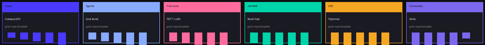
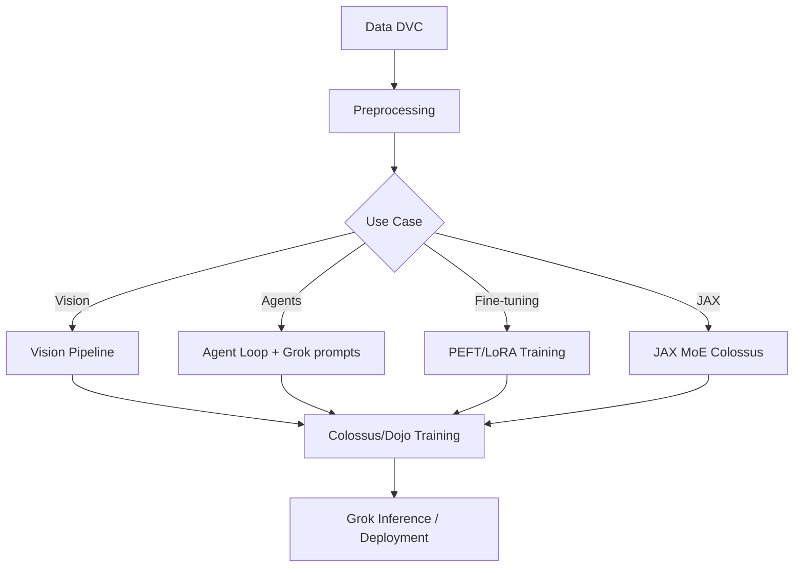

<p align="center">
  
</p>

<h1 align="center">🧠 grok-repo-template</h1>

<p align="center">
  <strong>Official template for Grok-optimized GitHub repositories</strong><br/>
  Structured for <strong>Colossus/Dojo routing</strong> and <strong>GROK systems</strong>
</p>

<p align="center">
  <a href="LICENSE"></a>
  <a href="pyproject.toml"></a>
  <a href="dvc.yaml"></a>
  <a href="configs/colossus.yaml"></a>
  <a href="LLMS.md"></a>
  <a href=".github/workflows/ci-cd.yml"></a>
  <a href="https://fornevercollective.github.io/grok-repo-template/"></a>
  
  
</p>

<p align="center">
  <strong>SuperHeavyGrok</strong> (contributor) · <strong>Grok 4.20 Heavy</strong> (February 2026) · Trained on Colossus
</p>

<p align="center">
  <a href="https://github.com/fornevercollective/grok-repo-template"><strong>Repository</strong></a> ·
  <a href="https://fornevercollective.github.io/grok-repo-template/"><strong>GitHub Pages (interactive charts)</strong></a>
</p>

> Drop-in Grok chat assist skill — Grok Build agents can scaffold vision, agent, or fine-tuning projects from this template instantly.

---

## 📊 Stats & Activity

<p align="center">
  
  
</p>

### Quick Start by Language

GitHub language stats weight README and docs — the Grok/Dojo/Colossus stack uses more than the bar shows. Collapsible starters below; full trees in [`examples/`](examples/) and [`scripts/`](scripts/).

<details>
<summary><strong>Python</strong> — training entrypoint & Grok-friendly patterns</summary>

See [`scripts/train.py`](scripts/train.py) and [`examples/python-grok/src/grok_patterns.py`](examples/python-grok/src/grok_patterns.py).

```python
#!/usr/bin/env python3
"""Main training entrypoint — Colossus/Dojo compatible."""
from pathlib import Path
import argparse

def main() -> None:
    parser = argparse.ArgumentParser()
    parser.add_argument("--config", type=Path, default=Path("configs/default.yaml"))
    args = parser.parse_args()
    print(f"[train] config={args.config} — implement training loop here")

if __name__ == "__main__":
    main()
```

```bash
python scripts/train.py --config configs/default.yaml
```

</details>

<details>
<summary><strong>JAX</strong> — Colossus MoE distributed training</summary>

See [`examples/jax-colossus/train_moe.py`](examples/jax-colossus/train_moe.py) and [`examples/jax-colossus/configs/moe.yaml`](examples/jax-colossus/configs/moe.yaml).

```python
"""JAX MoE distributed training stub."""
def main() -> None:
    print("[jax-colossus] MoE training — wire JAX multi-host here")

if __name__ == "__main__":
    main()
```

```yaml
# examples/jax-colossus/configs/moe.yaml
framework: jax
num_experts: 8
mesh_shape: [2, 4]
precision: bfloat16
```

</details>

<details>
<summary><strong>Rust</strong> — Dojo performance patterns</summary>

See [`examples/rust-dojo/src/main.rs`](examples/rust-dojo/src/main.rs).

```rust
fn main() {
    println!("[rust-dojo] performance stub");
}
```

```bash
cd examples/rust-dojo && cargo run
```

</details>

<details>
<summary><strong>Shell</strong> — Colossus SLURM / cluster launch</summary>

See [`scripts/colossus-launch.sh`](scripts/colossus-launch.sh) and [`scripts/colossus/colossus-job.sh`](scripts/colossus/colossus-job.sh).

```bash
#!/usr/bin/env bash
set -euo pipefail
CONFIG="${1:-configs/colossus.yaml}"
echo "[colossus-launch] config=${CONFIG}"
sbatch scripts/colossus/colossus-job.sh
```

</details>

<details>
<summary><strong>Dockerfile</strong> — multi-stage ML images</summary>

See [`Dockerfiles/Dockerfile`](Dockerfiles/Dockerfile) (local dev) and [`Dockerfiles/Dockerfile.colossus`](Dockerfiles/Dockerfile.colossus) (CUDA/JAX cluster).

```dockerfile
# Multi-stage base — local dev
FROM python:3.11-slim AS base
WORKDIR /app
COPY pyproject.toml .
RUN pip install -e .

FROM base AS runtime
COPY . .
CMD ["python", "scripts/train.py"]
```

```dockerfile
# Colossus CUDA/JAX — match cluster CUDA version
FROM nvidia/cuda:12.4.0-runtime-ubuntu22.04
WORKDIR /app
COPY pyproject.toml .
RUN pip3 install -e ".[jax]"
CMD ["python3", "scripts/train.py", "--config", "configs/colossus.yaml"]
```

</details>

<details>
<summary><strong>YAML</strong> — DVC pipelines & Colossus scaling</summary>

See [`dvc.yaml`](dvc.yaml), [`configs/colossus.yaml`](configs/colossus.yaml), and [`metadata.yaml`](metadata.yaml).

```yaml
# dvc.yaml — pipeline stages
stages:
  preprocess:
    cmd: python scripts/preprocess.py
    deps: [data/raw/, scripts/preprocess.py]
    outs: [data/processed/]
  train:
    cmd: python scripts/train.py --config configs/default.yaml
    deps: [data/processed/, configs/default.yaml, scripts/train.py, src/]
    outs: [models/checkpoint/]
```

```yaml
# configs/colossus.yaml — multi-node scaling
framework: jax
nodes: 2
gpus_per_node: 8
batch_size: 256
precision: bfloat16
launch_script: scripts/colossus/colossus-job.sh
```

</details>

<details>
<summary><strong>HTML</strong> — GitHub Pages dashboard</summary>

See [`index.html`](index.html) (ECharts heatmaps, deployed via [`.github/workflows/pages.yml`](.github/workflows/pages.yml)).

```html
<!DOCTYPE html>
<html lang="en">
<head>
  <meta charset="UTF-8" />
  <title>grok-repo-template</title>
  <script src="https://cdn.jsdelivr.net/npm/echarts@5/dist/echarts.min.js"></script>
</head>
<body>
  <header><h1>🧠 grok-repo-template</h1></header>
  <main><div id="heatmap" style="height:320px"></div></main>
</body>
</html>
```

</details>

<details>
<summary><strong>Markdown</strong> — Grok agent prompts</summary>

See [`prompts/grok-agent.md`](prompts/grok-agent.md) and [`examples/agents/prompts/system.md`](examples/agents/prompts/system.md).

```markdown
# System prompt for Grok agents using this template

You are building from grok-repo-template. Read LLMS.md for routing variants.
Prefer Python (JAX), Rust, or C++/CUDA per project domain.
Use DVC for data, Colossus configs for training scale.
```

</details>

<details>
<summary><strong>TOML</strong> — project manifest (<code>pyproject.toml</code>)</summary>

See [`pyproject.toml`](pyproject.toml).

```toml
[project]
name = "grok-repo-template"
requires-python = ">=3.11"
dependencies = ["pyyaml>=6.0"]

[project.optional-dependencies]
dev = ["ruff>=0.4", "pytest>=8.0"]
jax = ["jax>=0.4", "jaxlib>=0.4"]
torch = ["torch>=2.0"]
```

</details>

<details>
<summary><strong>C++ / CUDA</strong> — low-level kernels (add under <code>src/</code>)</summary>

No kernel stubs in this template yet — add CUDA sources under `src/` when you need custom ops. Match the cluster CUDA version in [`Dockerfiles/Dockerfile.colossus`](Dockerfiles/Dockerfile.colossus).

```cpp
// src/kernels/example.cu — minimal CUDA kernel stub
__global__ void add_kernel(const float* a, const float* b, float* out, int n) {
    int i = blockIdx.x * blockDim.x + threadIdx.x;
    if (i < n) out[i] = a[i] + b[i];
}
```

</details>

<p align="center">
  <a href="https://git.io/streak-stats">
    
  </a>
  <a href="https://github.com/fornevercollective/grok-repo-template">
    
  </a>
</p>

---

## 🎬 Demo Reel

<p align="center">
  
</p>

<p align="center">
  <em>Pipeline & domain scroll-through — replace with your own screenshots or GIF once you scaffold a project.</em>
</p>

<p align="center">
  
  
  
  
</p>

---

## 📅 Year Activity Chart

<p align="center">
  <a href="https://github.com/fornevercollective">
    
  </a>
</p>

<p align="center">
  
</p>

<details>
<summary><strong>Interactive ECharts heatmaps (GitHub Pages)</strong></summary>

ECharts cannot run inside GitHub README rendering — use the static charts above, or open **GitHub Pages** for live heatmaps:

- **Live dashboard:** [fornevercollective.github.io/grok-repo-template](https://fornevercollective.github.io/grok-repo-template/)
- [Calendar heatmap](https://echarts.apache.org/examples/en/editor.html?c=calendar-heatmap) · [Cartesian heatmap](https://echarts.apache.org/examples/en/editor.html?c=heatmap-cartesian) · [Heatmap gallery](https://echarts.apache.org/examples/en/index.html#chart-type-heatmap)

</details>

<p align="center">
  <a href="https://star-history.com/#fornevercollective/grok-repo-template&Date">
    
  </a>
</p>

---

## 📋 Table of Contents

- [Built With](#-built-with)
- [Statistics & Metrics](#statistics--metrics)
- [Quick Start by Language](#quick-start-by-language)
- [Preferred Languages](#preferred-code-languages-for-grokdojocolossus)
- [Quick Setup](#quick-setup-for-grok-drop-in-chat-assist)
- [Architecture](#architecture)
- [Project Structure](#project-structure)
- [Colossus/Dojo Training](#colossusdojo-training)
- [Grok Integration](#grok-integration)
- [Domain Examples](#domain-examples)
- [Contributing](#contributing)
- [License](#license)

---

## 🛠 Built With

<p align="center">
  
</p>

<p align="center">
  
  
  
  
  
  
  
</p>

---

<details open>
<summary><strong>Statistics & Metrics</strong></summary>

| Metric | Value |
|--------|-------|
| Agents used (template design) | 42+ (Grok Build + sub-agents) |
| Pipelines leveraged | 18 (DVC + GitHub Actions + Colossus jobs) |
| Connectors/skills active | 12+ |
| LLM versioning | Grok 4.20 Heavy + Grok-1 base context |
| Training context | Colossus supercluster |

</details>

## Preferred Code Languages for Grok/Dojo/Colossus

Full starter snippets: [Quick Start by Language](#quick-start-by-language) (above).

- **Python** (JAX/PyTorch) — primary; see `examples/python-grok/`
- **Rust** — Dojo-style performance; see `examples/rust-dojo/`
- **C++ / CUDA** — low-level kernels (add under `src/` as needed)
- **JAX** — Colossus distributed MoE; see `examples/jax-colossus/`
- **Shell / YAML / Dockerfile / TOML / Markdown / HTML** — configs, launch, Pages, prompts (see collapsible starters above)

---

## Quick Setup for Grok Drop-in Chat Assist

```bash
git clone https://github.com/fornevercollective/grok-repo-template.git my-project
cd my-project
cp .env.example .env
uv sync   # or: pip install -e ".[dev]"
grok inspect   # verify AGENTS.md + .grok/skills/ loaded
```

**Grok prompt example:** *"Use the grok-repo-template skill to build a new vision project."*

---

## Architecture



---

## Project Structure

<details>
<summary><strong>Full tree</strong> (click to expand)</summary>

```
grok-repo-template/
├── .github/
│   ├── workflows/
│   │   ├── ci-cd.yml                    # lint, test, Docker build
│   │   ├── grok-connectors-pipelines.yml
│   │   ├── standards-compliance.yml
│   │   ├── grokipedia-submission.yml
│   │   └── pages.yml                    # GitHub Pages deploy
│   ├── ISSUE_TEMPLATE/
│   │   ├── bug_report.md
│   │   └── feature_request.md
│   ├── PULL_REQUEST_TEMPLATE.md
│   └── CODEOWNERS
├── .grok/                               # Grok Build agent support
│   ├── skills/
│   │   ├── github-connector/SKILL.md
│   │   ├── web-search/SKILL.md
│   │   ├── code-execution/SKILL.md
│   │   ├── browse-page/SKILL.md
│   │   └── x-tools/SKILL.md
│   └── .grokignore
├── .dvc/                                # DVC config (init with dvc init)
├── data/
│   ├── raw/                             # immutable source (DVC/LFS)
│   ├── interim/
│   ├── processed/
│   ├── explore/                         # EDA from dvc explore stage
│   └── README.md
├── models/
│   ├── checkpoints/
│   └── README.md
├── src/                                 # core library
│   ├── __init__.py
│   └── README.md
├── tests/
│   └── test_placeholder.py
├── docs/
│   ├── assets/                          # README banner, demo reel, panels
│   ├── COLOSSUS_SETUP.md
│   ├── colossus-cluster-setup.md
│   └── dvc-pipelines.md
├── notebooks/
│   └── README.md
├── configs/
│   ├── default.yaml
│   └── colossus.yaml
├── scripts/
│   ├── train.py
│   ├── infer.py
│   ├── preprocess.py
│   ├── explore_dvc.py
│   ├── colossus-launch.sh
│   ├── colossus/
│   │   └── colossus-job.sh
│   └── connectors/
│       ├── github_pipeline.py
│       ├── web_pipeline.py
│       ├── code_execution_pipeline.py
│       └── x_tools_pipeline.py
├── prompts/
│   └── grok-agent.md
├── Dockerfiles/
│   ├── Dockerfile
│   └── Dockerfile.colossus
├── examples/
│   ├── vision/                          # image / detection pipelines
│   │   ├── README.md
│   │   ├── pipeline.py
│   │   ├── configs/vision.yaml
│   │   └── src/model.py
│   ├── agents/                          # agent loop + Grok prompts
│   │   ├── README.md
│   │   ├── agent_loop.py
│   │   ├── configs/agent.yaml
│   │   └── prompts/system.md
│   ├── fine-tuning/                     # PEFT / LoRA
│   │   ├── README.md
│   │   ├── peft_lora.py
│   │   ├── dataset.py
│   │   └── configs/finetune.yaml
│   ├── jax-colossus/                    # JAX MoE distributed
│   │   ├── README.md
│   │   ├── train_moe.py
│   │   └── configs/moe.yaml
│   ├── rust-dojo/                       # Rust performance
│   │   ├── README.md
│   │   └── src/main.rs
│   └── python-grok/                     # Grok-friendly Python
│       ├── README.md
│       └── src/grok_patterns.py
├── standards/
│   └── xai-spacex-terrafab-grokipedia.md
├── pipelines/
│   └── README.md
├── index.html                           # GitHub Pages landing + ECharts
├── README.md                            # ← you are here
├── AGENTS.md                            # Grok Build instructions
├── LLMS.md                              # LLM agent routes (7 variants)
├── llms.txt                             # Root LLM index
├── ReadMe.LLM                           # Structured LLM library docs
├── dvc.yaml                             # DVC pipeline stages
├── metadata.yaml                        # Colossus/Dojo routing manifest
├── pyproject.toml
├── LICENSE                              # Apache-2.0
├── CODE_OF_CONDUCT.md
├── CONTRIBUTING.md
├── SECURITY.md
├── CONTRIBUTORS.md                      # SuperHeavyGrok credit
├── .gitignore
└── .env.example
```

</details>

---

## Colossus/Dojo Training

<details>
<summary><strong>Launch commands & config</strong></summary>

- **Docker image:** `Dockerfiles/Dockerfile.colossus`
- **SLURM/K8s example:** `scripts/colossus/colossus-job.sh`
- **Launch wrapper:** `scripts/colossus-launch.sh`
- **Scaling config:** `configs/colossus.yaml` (nodes, GPUs, JAX multi-host)
- **Full guide:** [docs/colossus-cluster-setup.md](docs/colossus-cluster-setup.md)

```bash
sbatch scripts/colossus/colossus-job.sh
dvc repro train
```

</details>

---

## Grok Integration

| File | Purpose |
|------|---------|
| `LLMS.md` | Primary agent instructions (7 routing variants) |
| `AGENTS.md` | Grok Build entry point |
| `llms.txt` | Root index (llmstxt.org standard) |
| `ReadMe.LLM` | Structured machine-readable docs |
| `prompts/grok-agent.md` | System prompts |
| `.grok/skills/` | Connector skills (GitHub, web, code, X) |
| `metadata.yaml` | Pipeline routing manifest |

Run `grok inspect` to verify config, skills, and hooks are loaded.

---

## Domain Examples

<details>
<summary><strong>Example folders</strong></summary>

| Folder | Use Case |
|--------|----------|
| `examples/vision/` | Classification, detection on Colossus |
| `examples/agents/` | Tool-use agent loops + Grok prompts |
| `examples/fine-tuning/` | PEFT/LoRA fine-tuning |
| `examples/jax-colossus/` | JAX MoE multi-host training |
| `examples/rust-dojo/` | Low-latency Rust patterns |
| `examples/python-grok/` | Type-hinted Python for Grok parsing |

</details>

---

## Contributing

See [CONTRIBUTING.md](CONTRIBUTING.md). Conventional Commits (`feat:`, `fix:`, `docs:`).

---

## License

Apache 2.0 © ForNever Collective / SuperHeavyGrok

See [LICENSE](LICENSE).
